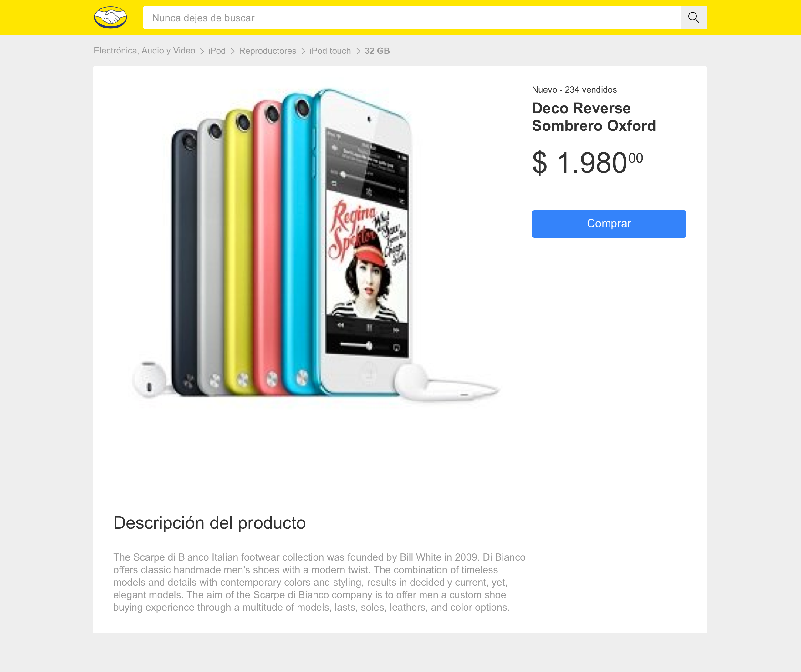
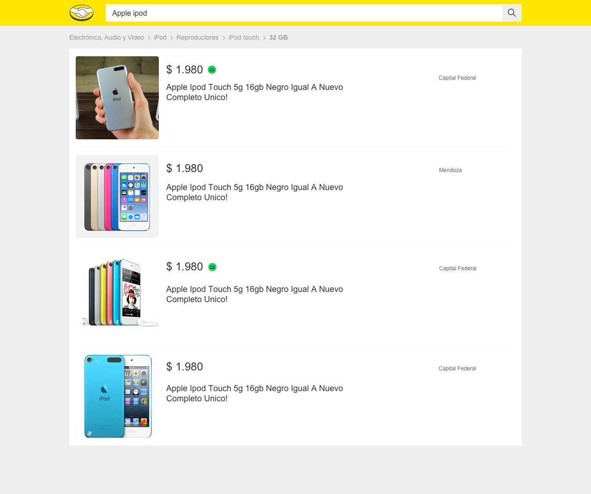
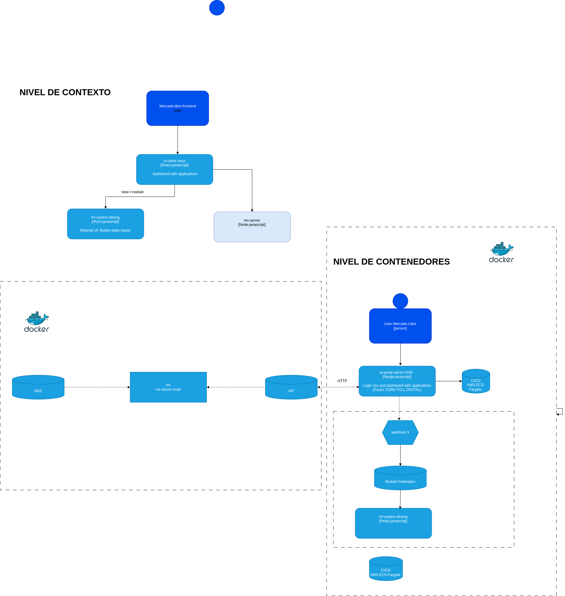

# Test Mercado Libre Frontend

Este proyecto tiene como objetivo desarrollar una arquitectura de **Micro Frontends** para implementar funcionalidades específicas en la plataforma de Mercado Libre. Se incluye un diseño modular, un buscador y vistas detalladas.

## 📂 Estructura del Proyecto

- **mf-system-desing**: Sistema base para la arquitectura del diseño.
- **ms-server**: Servidor backend que soporta la funcionalidad de los microfrontends.
- **ui-client-react**: Aplicación cliente desarrollada en React.
- **ux-material**: Recursos de diseño.

---

## 📸 Capturas de Pantalla

### 🟢 **Buscador**
Este componente permite realizar búsquedas rápidas y dinámicas en la plataforma.


### 🟢 **Buscador (Versión 2X)**
Detalle en alta resolución.


---

### 🟢 **Detalle del Producto**
Pantalla para mostrar información detallada sobre un producto.


### 🟢 **Detalle del Producto (Versión 2X)**
Detalle en alta resolución.



---

### 🟢 **Resultados**
Página con los resultados de búsqueda.



### 🟢 **Resultados (Versión 2X)**
Detalle en alta resolución.


---

## 🛠️ Propuesta de Arquitectura
Este diagrama detalla la propuesta arquitectónica para los micro frontends utilizados en este proyecto.



---

## 🧑‍💻 Requisitos del Proyecto

1. **Node.js**: Recomendado v16 o superior.
2. **React**: Usado para la UI del cliente.
3. **Docker**: Para contenedores y despliegues.
4. **AWS ECS**: Para la orquestación de microfrontends (opcional).

---

## 🚀 Instalación y Uso

1. Clona el repositorio:
   ```bash
   git clone https://github.com/Danvar03/Test_mercado_libre_frontend.gitgit
   cd test-mercado-libre-frontend
